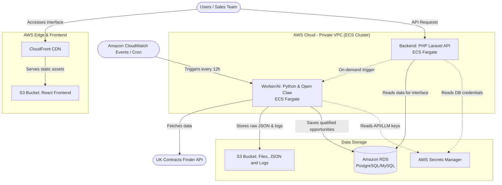

# GovGrasp: Cloud Architecture and Architecture Decision Records (ADRs)

## 1. Architecture Diagram (AWS Serverless & Containers)

The diagram below illustrates the data flow and infrastructure on AWS, using a Serverless container approach (Fargate) for maximum isolation and maintainability.

## 2. Architecture Decision Records (ADRs)
The ADRs document the reasoning behind our choice of specific tools and technologies for the GovGrasp project.

### ADR 001: Choice of React for the Frontend
* **Status:** Accepted
* **Context:** We require an interactive, fast, and easily deployable administration interface to display filtered opportunities, with the capability to evolve into a fully-fledged SaaS dashboard in the future.
* **Decision:** We will use React.
* **Justification:** * Enables the creation of a highly reactive Single Page Application (SPA).
  * The generated build is static (HTML/CSS/JS), allowing for near-zero cost hosting and high performance using AWS S3 and CloudFront.
  * Extensive component ecosystem (e.g., Tailwind, Material UI) to accelerate dashboard development.

### ADR 002: Choice of PHP/Laravel for the Backend
* **Status:** Accepted
* **Context:** The frontend requires a robust API to list opportunities, manage trigger configurations, dispatch on-demand notifications, and handle business rules unrelated to AI.
* **Decision:** We will use PHP with the Laravel framework.
* **Justification:** * Laravel is the gold standard in the PHP community for rapidly building robust APIs (Routing, Eloquent ORM, Authentication Middleware).
  * Excellent maintainability and a very high productivity curve for traditional business rules (configuration CRUDs, email/WhatsApp dispatch queues).
  * Fits perfectly within a Docker container, facilitating deployment on AWS ECS.

### ADR 003: Choice of Python for Extraction and Artificial Intelligence (Open Claw)
* **Status:** Accepted
* **Context:** The core of the system is to monitor contracts via API, process large JSONs, and run artificial intelligence agents (LLMs) to filter complex "Software Development" data.
* **Decision:** We will use Python.
* **Justification:** * Python is the industry standard for data and AI. LLM SDKs, as well as agent frameworks like LangChain and Open Claw, are "Python-first".
  * Native and third-party libraries (such as requests and pydantic) make ingesting and validating the British OCDS API extremely secure and efficient.
  * Separating heavy AI processing (Python) from the traditional web server (PHP) avoids performance bottlenecks and allows for independent scaling of resources.

### ADR 004: Use of AWS ECS/Fargate (Serverless Containers)
* **Status:** Accepted
* **Context:** We need to run the PHP application and the Python worker reliably and scalably, without the operational overhead of managing the underlying operating system (patching, updates).
* **Decision:** We will host the containers (PHP and Python) on Amazon ECS using the Fargate launch type.
* **Justification:** * Serverless: Fargate removes the need to provision EC2 instances. We only pay for the CPU and RAM the container consumes whilst running.
  * The Python worker (which runs every 12 hours or on-demand) will not sit idle consuming resources 24/7; it spins up, processes, and spins down.
  * The PHP backend can scale horizontally based on the API traffic received from the React interface.

### ADR 005: Hybrid Storage (AWS S3 + Amazon RDS)
* **Status:** Accepted
* **Context:** The system handles two types of data: structured state (pre-processed tenders, configurations) and heavy objects (raw JSON files from the API, execution logs).
* **Decision:** We will use Amazon RDS for relational and structured data, and Amazon S3 for blob storage and assets.
* **Justification:** * RDS (PostgreSQL or MySQL): Ensures data integrity, fast complex queries from the React interface (via the Laravel API), and strict transactional control.
  * S3: The most cost-effective and durable option for storing the raw "Data Lake" (the unprocessed JSON from the UK Contracts API) for auditing purposes, as well as for storing container images generated by the CI/CD pipeline (via Amazon ECR which uses S3 under the hood).
"""
